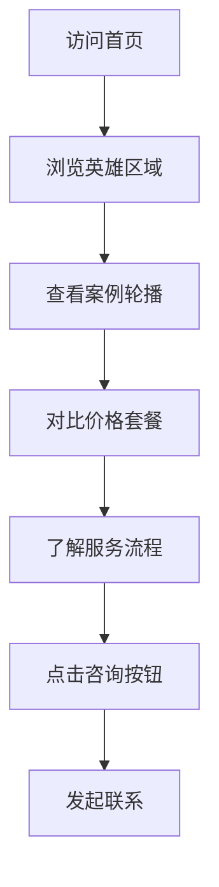

## 1. 产品概述
为高端PPT定制服务打造响应式单页网站，展示专业设计能力与服务质量，帮助客户快速了解服务价值并促成咨询转化。面向企业高管、创业者、演讲者等对PPT品质有高要求的专业人群。

## 2. 核心功能

### 2.1 用户角色
| 角色 | 注册方式 | 核心权限 |
|------|----------|----------|
| 访客用户 | 无需注册 | 浏览全站内容、查看案例、了解价格、发起咨询 |
| 管理员 | 后台配置 | 编辑网站内容、更新案例图片、调整价格信息、修改样式配置 |

### 2.2 功能模块
网站包含以下核心页面：
1. **首页**：顶部导航、英雄区域、案例轮播、价格展示、服务流程、页脚信息

### 2.3 页面详情
| 页面名称 | 模块名称 | 功能描述 |
|----------|----------|----------|
| 首页 | 顶部导航 | 固定定位展示logo和菜单项，移动端自动折叠为汉堡菜单，包含咨询按钮点击跳转 |
| 首页 | 英雄区域 | 渐变背景展示主标题副标题，配置双CTA按钮（立即咨询/查看案例），展示信任标识模块 |
| 首页 | 案例轮播 | 支持19张案例图片轮播展示，配置左右切换按钮和底部圆形指示器，自动播放3秒间隔，鼠标悬停暂停 |
| 首页 | 价格展示 | 渐变标题栏配5行4列表格展示服务套餐价格，底部2列提示卡片说明加急和其他收费 |
| 首页 | 服务流程 | 纵向流程线配分步卡片展示6个服务步骤，每个卡片含数字序号、图标、详细列表内容 |
| 首页 | 页脚信息 | 展示联系方式、服务时间、版权声明等基础信息 |

## 3. 核心流程
访客用户浏览流程：
1. 访问首页 → 浏览英雄区域了解核心价值 → 查看案例轮播评估设计能力 → 对比价格套餐 → 了解服务流程 → 点击咨询按钮发起联系

管理员编辑流程：
1. 登录管理后台 → 编辑文本内容（标题、价格、说明）→ 上传替换案例图片 → 调整颜色配置 → 保存发布更新

## 4. 用户界面设计

### 4.1 设计风格
- **主色调**：#165DFF（深蓝）、#36BFFA（浅蓝）、#0A3D91（藏青）
- **辅助色**：#FF9F1C（橙色）、#0BD9A7（绿色）
- **渐变背景**：135°线性渐变，从#165DFF到#36BFFA再到#0A3D91
- **字体规范**：Inter字体，标题粗体、正文常规字重，支持文字阴影和渐变文字效果
- **按钮样式**：圆角设计，hover时轻微缩放+发光效果
- **卡片阴影**：默认shadow-card（0 10px 15px -3px rgba(0,0,0,0.05)），hover升级为shadow-card-hover（0 20px 25px -5px rgba(0,0,0,0.1)）
- **圆角规范**：图片容器统一24px圆角，lg级阴影
- **图标风格**：使用Font Awesome图标库，保持简洁现代风格

### 4.2 页面设计概览
| 页面名称 | 模块名称 | UI元素 |
|----------|----------|--------|
| 首页 | 顶部导航 | 固定定位白色背景，logo左侧显示，导航菜单居中，咨询按钮右侧突出显示，移动端汉堡菜单展开收起流畅 |
| 首页 | 英雄区域 | 全屏渐变背景，大标题48px粗体居中，副标题20px常规字重，双CTA按钮24px圆角，信任标识横向排列 |
| 首页 | 案例轮播 | 容器最大宽度1200px，图片16:9比例，左右箭头按钮圆形48px直径，底部指示器12px直径间距8px |
| 首页 | 价格展示 | 渐变标题栏高度80px，价格表格斑马纹背景，提示卡片横向排列带图标和说明文字 |
| 首页 | 服务流程 | 纵向流程线宽度2px，步骤卡片最大宽度800px，数字序号圆形32px直径，图标大小24px |

### 4.3 响应式设计
- **桌面端优先**：保持设计稿完整布局，导航展开显示，案例统计3列布局，价格表5行4列
- **移动端适配**：导航折叠为汉堡菜单，所有多列布局转为单列，轮播图高度自适应屏幕宽度
- **断点设置**：768px为移动端分界点，1024px为平板端分界点
- **触摸优化**：按钮点击区域不小于44px，轮播滑动支持触摸操作

### 4.4 动画交互规范
- **基础交互时长**：0.3s缓动过渡
- **长动画时长**：0.8s流程线填充、图片加载动画
- **滚动动画**：元素随滚动渐入+上移，阶梯式延迟触发
- **轮播交互**：自动播放3秒间隔，鼠标悬停暂停，切换无延迟无白屏
- **图片加载**：首张eager加载，其余18张lazy加载，触发淡入+缩放动画