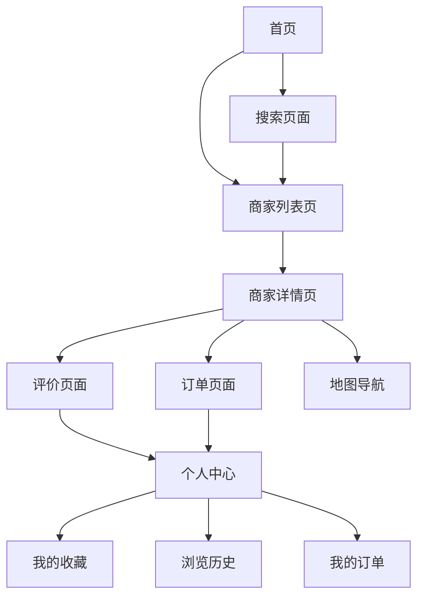

## 1. 产品概述
大众点评类本地生活服务平台，连接消费者与本地商家。为用户提供商家发现、评价分享、在线预订等一站式服务，帮助商家提升曝光度和客流量。

目标用户：寻找本地餐饮、娱乐、生活服务的消费者；希望提升线上曝光的本地商家。

## 2. 核心功能

### 2.1 用户角色
| 角色 | 注册方式 | 核心权限 |
|------|----------|----------|
| 普通用户 | 手机号/邮箱注册 | 浏览商家、发布评价、收藏店铺、下单预订 |
| 商家用户 | 企业认证注册 | 管理店铺信息、回复评价、查看经营数据 |
| 平台管理员 | 后台创建 | 审核商家、管理内容、系统配置 |

### 2.2 功能模块
核心页面列表：
1. **首页**：搜索栏、分类导航、推荐商家、热门活动
2. **商家列表页**：筛选器、商家卡片、地图模式
3. **商家详情页**：基本信息、图片展示、用户评价、预订入口
4. **评价页面**：星级评分、文字评价、图片上传、提交评价
5. **个人中心**：用户信息、我的收藏、浏览历史、我的订单
6. **搜索页面**：搜索建议、搜索结果、搜索历史

### 2.3 页面详情
| 页面名称 | 模块名称 | 功能描述 |
|----------|----------|----------|
| 首页 | 搜索模块 | 支持关键词搜索、语音搜索、热门搜索词展示 |
| 首页 | 分类导航 | 展示美食、购物、娱乐等分类，支持二级分类 |
| 首页 | 推荐商家 | 基于地理位置和用户偏好的个性化推荐 |
| 商家列表页 | 筛选器 | 按距离、评分、价格、菜系等多维度筛选 |
| 商家列表页 | 商家卡片 | 展示商家图片、名称、评分、人均消费、距离 |
| 商家详情页 | 基本信息 | 显示地址、电话、营业时间、商家简介 |
| 商家详情页 | 图片轮播 | 展示商家环境、菜品图片，支持放大查看 |
| 商家详情页 | 地图定位 | 显示商家位置，支持导航和路线规划 |
| 商家详情页 | 评价列表 | 展示用户评价、评分分布、标签云 |
| 评价页面 | 星级评分 | 1-5星评分，支持分项评分（口味、环境、服务） |
| 评价页面 | 图片上传 | 支持多图上传、图片压缩、添加滤镜 |
| 评价页面 | 评价提交 | 文字评价、标签选择、匿名评价选项 |
| 个人中心 | 用户信息 | 头像、昵称、会员等级、积分展示 |
| 个人中心 | 我的收藏 | 收藏的商家列表、批量管理 |
| 个人中心 | 浏览历史 | 最近浏览的商家记录、清空历史 |
| 个人中心 | 我的订单 | 订单状态跟踪、订单详情、取消订单 |
| 搜索页面 | 智能提示 | 输入时实时显示搜索建议 |
| 搜索页面 | 搜索结果 | 按相关度排序的商家和评价结果 |

## 3. 核心流程

### 用户流程
1. 用户打开首页 → 浏览推荐商家或使用搜索功能
2. 选择感兴趣商家 → 查看详情和评价
3. 决定消费 → 在线预订或获取优惠券
4. 消费完成后 → 发布评价和分享体验

### 商家流程
1. 商家注册认证 → 完善店铺信息
2. 上传店铺图片 → 设置营业信息
3. 管理用户评价 → 回复用户反馈
4. 查看经营数据 → 优化服务质量

## 4. 用户界面设计

### 4.1 设计风格
- **主色调**：橙色（#FF6B35）代表活力，灰色（#F5F5F5）作为背景
- **按钮样式**：圆角矩形，主要按钮使用渐变色
- **字体**：系统默认字体，标题18px，正文14px
- **布局风格**：卡片式布局，顶部导航栏，底部标签栏
- **图标风格**：线性图标，简洁现代风格

### 4.2 页面设计
| 页面名称 | 模块名称 | UI元素 |
|----------|----------|--------|
| 首页 | 搜索栏 | 顶部固定，圆角搜索框，语音搜索图标 |
| 首页 | 分类导航 | 宫格布局，彩色图标，支持横向滑动 |
| 商家列表页 | 商家卡片 | 左图右文布局，圆角图片，评分星级显示 |
| 商家详情页 | 图片轮播 | 全宽轮播图，指示器，支持手势滑动 |
| 商家详情页 | 基本信息 | 图标+文字形式，清晰的信息层级 |
| 评价页面 | 评分组件 | 大星星图标，支持点击和滑动评分 |
| 个人中心 | 用户头像 | 圆形头像，会员等级标识 |

### 4.3 响应式设计
- **桌面端优先**：充分利用大屏幕空间，多列布局
- **移动端适配**：自适应布局，触摸友好的交互设计
- **断点设置**：768px（平板）、1024px（桌面）
- **图片优化**：支持WebP格式，懒加载实现

### 4.4 性能优化
- **加载策略**：首页预加载关键资源，懒加载图片
- **缓存机制**：本地缓存商家信息和用户数据
- **压缩优化**：JS/CSS文件压缩合并，图片压缩处理