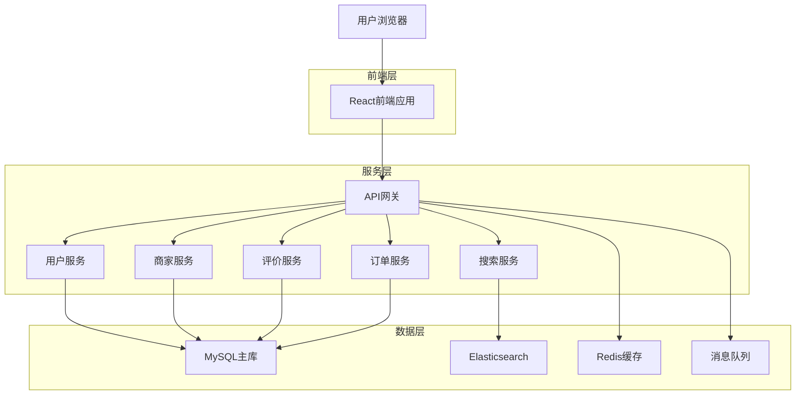
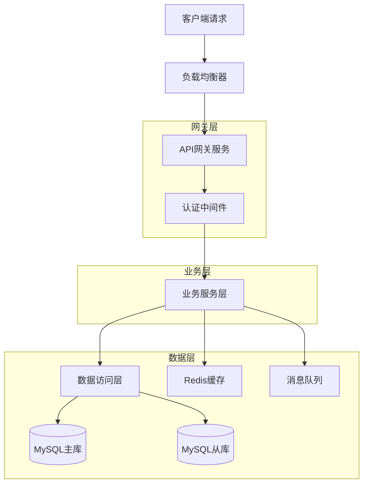
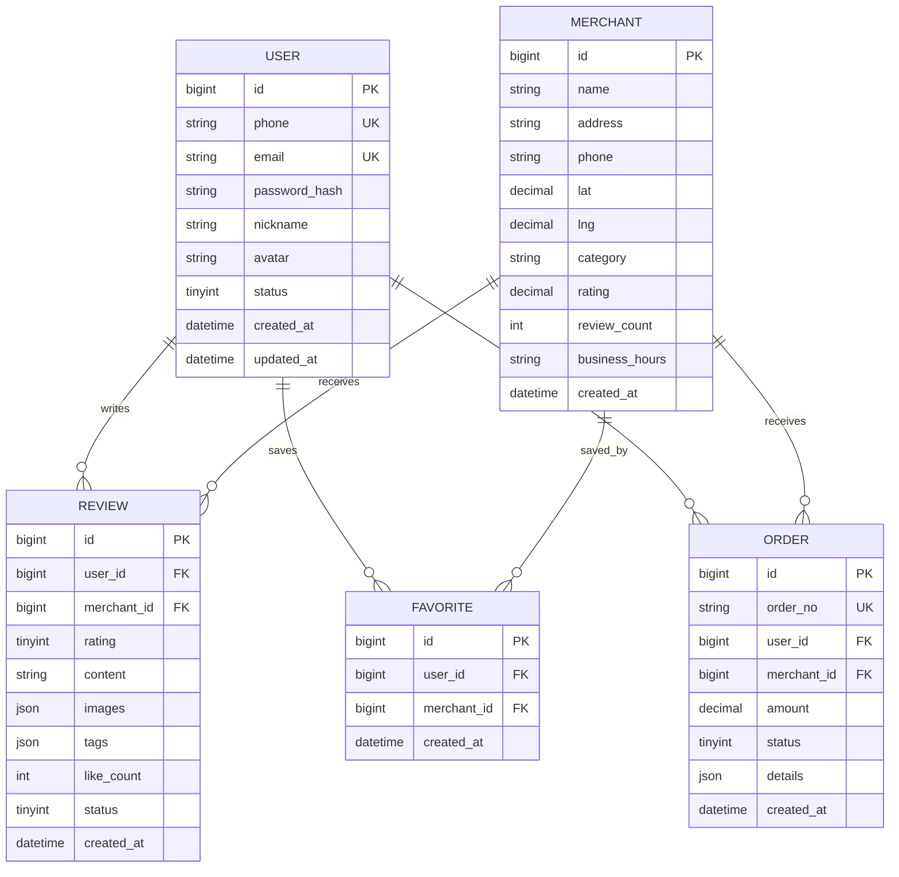

## 1. 架构设计



## 2. 技术描述

- **前端**：React@18 + TypeScript + Vite + Tailwind CSS
- **初始化工具**：vite-init
- **后端**：Node.js@18 + Express@4 + TypeScript
- **数据库**：MySQL 8.0（主从架构）
- **缓存**：Redis 7.0
- **搜索引擎**：Elasticsearch 8.0
- **消息队列**：RabbitMQ
- **文件存储**：阿里云OSS

## 3. 路由定义

| 路由 | 用途 |
|------|------|
| / | 首页，展示推荐商家和分类导航 |
| /search | 搜索页面，支持关键词和筛选搜索 |
| /merchant/:id | 商家详情页，展示商家信息和评价 |
| /category/:category | 分类页面，按类别展示商家 |
| /review/:merchantId | 评价页面，提交对商家的评价 |
| /user/profile | 个人中心，用户信息和管理 |
| /user/favorites | 收藏页面，管理收藏的商家 |
| /user/orders | 订单页面，查看历史订单 |
| /auth/login | 登录页面，用户身份验证 |
| /auth/register | 注册页面，新用户注册 |

## 4. API定义

### 4.1 用户认证API

```
POST /api/auth/login
```

请求参数：
| 参数名 | 类型 | 必需 | 描述 |
|--------|------|------|------|
| phone | string | true | 手机号 |
| password | string | true | 密码 |

响应参数：
| 参数名 | 类型 | 描述 |
|--------|------|------|
| token | string | JWT令牌 |
| userId | string | 用户ID |
| expiresIn | number | 过期时间（秒） |

### 4.2 商家相关API

```
GET /api/merchants
```

查询参数：
| 参数名 | 类型 | 必需 | 描述 |
|--------|------|------|------|
| lat | number | false | 纬度 |
| lng | number | false | 经度 |
| category | string | false | 分类 |
| radius | number | false | 搜索半径（米） |
| page | number | false | 页码 |
| limit | number | false | 每页数量 |

### 4.3 评价相关API

```
POST /api/reviews
```

请求参数：
| 参数名 | 类型 | 必需 | 描述 |
|--------|------|------|------|
| merchantId | string | true | 商家ID |
| rating | number | true | 评分（1-5） |
| content | string | true | 评价内容 |
| images | array | false | 图片URL数组 |
| tags | array | false | 标签数组 |

## 5. 服务器架构



## 6. 数据模型

### 6.1 数据库设计



### 6.2 数据定义语言

**用户表（users）**
```sql
CREATE TABLE users (
    id BIGINT PRIMARY KEY AUTO_INCREMENT,
    phone VARCHAR(20) UNIQUE NOT NULL,
    email VARCHAR(100) UNIQUE,
    password_hash VARCHAR(255) NOT NULL,
    nickname VARCHAR(50) NOT NULL,
    avatar VARCHAR(255),
    status TINYINT DEFAULT 1 COMMENT '1-正常 2-禁用',
    created_at DATETIME DEFAULT CURRENT_TIMESTAMP,
    updated_at DATETIME DEFAULT CURRENT_TIMESTAMP ON UPDATE CURRENT_TIMESTAMP,
    INDEX idx_phone (phone),
    INDEX idx_email (email)
) ENGINE=InnoDB DEFAULT CHARSET=utf8mb4;
```

**商家表（merchants）**
```sql
CREATE TABLE merchants (
    id BIGINT PRIMARY KEY AUTO_INCREMENT,
    name VARCHAR(100) NOT NULL,
    address VARCHAR(255) NOT NULL,
    phone VARCHAR(20),
    lat DECIMAL(10,8),
    lng DECIMAL(11,8),
    category VARCHAR(50) NOT NULL,
    rating DECIMAL(3,2) DEFAULT 0.00,
    review_count INT DEFAULT 0,
    business_hours JSON,
    images JSON,
    description TEXT,
    created_at DATETIME DEFAULT CURRENT_TIMESTAMP,
    updated_at DATETIME DEFAULT CURRENT_TIMESTAMP ON UPDATE CURRENT_TIMESTAMP,
    INDEX idx_category (category),
    INDEX idx_location (lat, lng),
    INDEX idx_rating (rating),
    FULLTEXT idx_name_desc (name, description)
) ENGINE=InnoDB DEFAULT CHARSET=utf8mb4;
```

**评价表（reviews）**
```sql
CREATE TABLE reviews (
    id BIGINT PRIMARY KEY AUTO_INCREMENT,
    user_id BIGINT NOT NULL,
    merchant_id BIGINT NOT NULL,
    rating TINYINT NOT NULL CHECK (rating BETWEEN 1 AND 5),
    content TEXT,
    images JSON,
    tags JSON,
    like_count INT DEFAULT 0,
    status TINYINT DEFAULT 1 COMMENT '1-正常 2-隐藏',
    created_at DATETIME DEFAULT CURRENT_TIMESTAMP,
    updated_at DATETIME DEFAULT CURRENT_TIMESTAMP ON UPDATE CURRENT_TIMESTAMP,
    FOREIGN KEY (user_id) REFERENCES users(id),
    FOREIGN KEY (merchant_id) REFERENCES merchants(id),
    INDEX idx_user_merchant (user_id, merchant_id),
    INDEX idx_merchant_rating (merchant_id, rating),
    INDEX idx_created_at (created_at)
) ENGINE=InnoDB DEFAULT CHARSET=utf8mb4;
```

## 7. 性能优化

### 7.1 缓存策略
- **Redis缓存**：商家基本信息、用户会话、热门搜索
- **本地缓存**：用户浏览历史、收藏列表
- **CDN缓存**：静态资源、商家图片

### 7.2 数据库优化
- **读写分离**：查询操作使用从库，写入操作使用主库
- **索引优化**：地理位置索引、复合索引、全文索引
- **分库分表**：按用户ID或商家ID进行水平分割

### 7.3 搜索优化
- **Elasticsearch**：支持地理位置搜索、全文搜索、聚合统计
- **搜索缓存**：热门搜索结果缓存30分钟
- **搜索建议**：基于用户输入的实时建议

## 8. 安全设计

### 8.1 认证授权
- **JWT令牌**：无状态认证，支持刷新机制
- **权限控制**：基于角色的访问控制（RBAC）
- **API限流**：基于IP和用户的请求频率限制

### 8.2 数据安全
- **密码加密**：bcrypt哈希存储
- **敏感数据**：手机号、邮箱脱敏显示
- **SQL注入**：使用参数化查询，输入验证
- **XSS防护**：输出编码，CSP策略

### 8.3 接口安全
- **HTTPS传输**：全站SSL加密
- **签名验证**：重要接口请求签名
- **防重放攻击**：时间戳+随机数验证