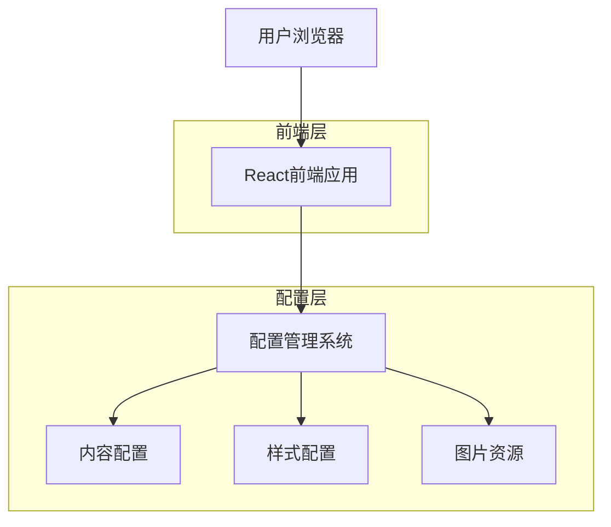
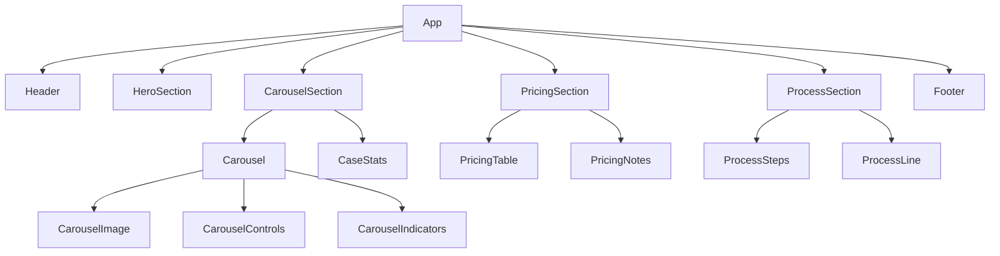

## 1. 架构设计



## 2. 技术描述
- **前端框架**：React@18 + TypeScript
- **构建工具**：Vite（vite-init初始化）
- **样式方案**：Tailwind CSS@3 + 自定义配置
- **动画库**：Framer Motion
- **图标库**：Font Awesome
- **图片处理**：原生lazy loading + Intersection Observer
- **后端服务**：无（纯静态部署）

## 3. 路由定义
| 路由 | 用途 |
|------|------|
| / | 首页，展示完整的单页网站内容 |

## 4. 配置系统设计

### 4.1 内容配置接口
```typescript
interface SiteConfig {
  // 英雄区域配置
  hero: {
    title: string
    subtitle: string
    ctaButtons: Array<{
      text: string
      link: string
      primary: boolean
    }>
    trustBadges: string[]
  }
  
  // 案例轮播配置
  carousel: {
    images: Array<{
      src: string
      alt: string
    }>
    autoplayInterval: number // 毫秒
    showIndicators: boolean
    showArrows: boolean
  }
  
  // 价格配置
  pricing: {
    title: string
    table: Array<{
      service: string
      basic: string
      standard: string
      premium: string
      vip: string
    }>
    notes: Array<{
      icon: string
      title: string
      description: string
    }>
  }
  
  // 服务流程配置
  process: {
    title: string
    steps: Array<{
      number: number
      icon: string
      title: string
      items: string[]
    }>
  }
  
  // 样式配置
  theme: {
    colors: {
      primary: string
      secondary: string
      accent: string
      gradient: {
        angle: number
        stops: string[]
      }
    }
    fonts: {
      family: string
      sizes: {
        title: string
        subtitle: string
        body: string
      }
    }
    shadows: {
      card: string
      cardHover: string
    }
    borderRadius: {
      card: string
      button: string
      image: string
    }
  }
}
```

### 4.2 组件配置示例
```typescript
// 配置文件示例 src/config/site.config.ts
export const siteConfig: SiteConfig = {
  hero: {
    title: "高端PPT定制服务",
    subtitle: "专业设计团队，打造卓越演示体验",
    ctaButtons: [
      { text: "立即咨询", link: "#contact", primary: true },
      { text: "查看案例", link: "#cases", primary: false }
    ],
    trustBadges: ["1000+成功案例", "10年专业经验", "98%客户满意度"]
  },
  carousel: {
    images: [
      { src: "/images/case1.jpg", alt: "企业介绍PPT案例" },
      // ... 更多图片配置
    ],
    autoplayInterval: 3000,
    showIndicators: true,
    showArrows: true
  },
  theme: {
    colors: {
      primary: "#165DFF",
      secondary: "#36BFFA",
      accent: "#FF9F1C",
      gradient: {
        angle: 135,
        stops: ["#165DFF", "#36BFFA", "#0A3D91"]
      }
    }
  }
}
```

## 5. 组件架构设计

### 5.1 核心组件结构


### 5.2 组件职责划分
- **Header**: 导航菜单、logo展示、移动端汉堡菜单
- **HeroSection**: 英雄区域布局、渐变背景、CTA按钮
- **CarouselSection**: 案例展示容器、轮播控制逻辑
- **PricingSection**: 价格展示容器、表格布局
- **ProcessSection**: 服务流程容器、步骤展示
- **Carousel**: 轮播核心组件、自动播放逻辑
- **PricingTable**: 价格表格组件、响应式布局
- **ProcessSteps**: 流程步骤组件、图标展示

## 6. 动画与交互实现

### 6.1 Framer Motion配置
```typescript
// 基础动画配置
const fadeInUp = {
  initial: { opacity: 0, y: 60 },
  animate: { opacity: 1, y: 0 },
  transition: { duration: 0.6, ease: "easeOut" }
}

const staggerContainer = {
  animate: {
    transition: {
      staggerChildren: 0.1
    }
  }
}

// 卡片hover效果
const cardHover = {
  scale: 1.05,
  boxShadow: "0 20px 25px -5px rgba(0,0,0,0.1)",
  transition: { duration: 0.3 }
}
```

### 6.2 滚动动画实现
- **Intersection Observer**: 检测元素进入视口
- **useInView Hook**: 自定义hook封装滚动检测逻辑
- **阶梯式延迟**: 多个元素依次触发动画效果
- **流程线填充**: 根据滚动进度动态改变样式

## 7. 性能优化策略

### 7.1 图片优化
- **懒加载**: 使用loading="lazy"属性
- **响应式图片**: srcset提供多尺寸图片
- **WebP格式**: 优先使用WebP格式减少体积
- **预加载**: 首张图片使用rel="preload"预加载

### 7.2 代码优化
- **组件懒加载**: 非首屏组件动态导入
- **Tree Shaking**: 移除未使用代码
- **代码分割**: 按路由和组件分割bundle
- **缓存策略**: 静态资源设置长期缓存

### 7.3 动画性能
- **GPU加速**: 使用transform和opacity属性
- **减少重绘**: 避免改变layout属性
- **节流优化**: 滚动事件添加节流处理
- **动画帧率**: 确保60fps流畅体验

## 8. 部署配置

### 8.1 构建配置
```typescript
// vite.config.ts
export default defineConfig({
  build: {
    target: 'es2015',
    minify: 'terser',
    terserOptions: {
      compress: {
        drop_console: true,
        drop_debugger: true
      }
    },
    rollupOptions: {
      output: {
        manualChunks: {
          vendor: ['react', 'react-dom'],
          motion: ['framer-motion']
        }
      }
    }
  }
})
```

### 8.2 环境变量
- **开发环境**: 启用sourcemap和热更新
- **生产环境**: 启用压缩和优化
- **CDN配置**: 静态资源使用CDN加速
- **HTTPS强制**: 生产环境强制HTTPS协议